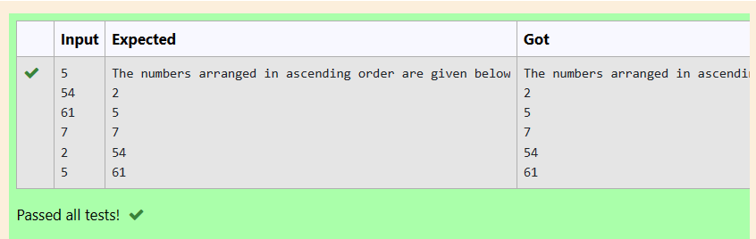

# EX3(D)Array Application
Developed by: ARSHITHA MS

Register number: 212223240015
 ## AIM:
 To write a program to print elements in ascending order and replace all odd elements by 1 in one dimensional array.
 ## ALGORITHM:
 1.Start the program

 2.Declare the variables

 3.Get input from the user using for loop.

 4.Use if condition to check if the number is even.
 
 5.Print the output using for loop.

 6.End the program

 
 ## PROGRAM
 ### Program 1(Ascending order):
 ```
#include<stdio.h>
int main()
{
    int a,n,i,j;
    scanf("%d",&n);
    int num[n];
    for(i=0;i<n;i++)
    {
        scanf("%d",&num[i]);
    }
    for(i=0;i<n;i++)
    {
        for(j=i+1;j<n;j++)
        {
            if(num[i]<num[j])
            {
                a=num[i];
                num[i]=num[j];
                num[j]=a;
            }
        }
    }
    printf("The numbers arranged in ascending order are given below \n");
    for(i=n-1;i>=0;i--)
    printf("%d\n",num[i]);
    return 0;
}
```
### Program 2(replace element):
```
#include <stdio.h>
int main()
{
    int n,i;
    scanf("%d",&n);
    int a[n];
    for(i=0;i<n;i++)
    {
        scanf("%d",&a[i]);
    }
    for(i=0;i<n;i++)
    {
        if(a[i]%2!=0)
        {
            a[i]=1;
        }
        printf("%d ",a[i]);
    }
}
```

## OUTPUT:
### Output 1:


### Output 2:


## RESULT:
Thus the program to print print elements in ascending order and replace all odd elements by 1 in one dimensional array is executed successfully.